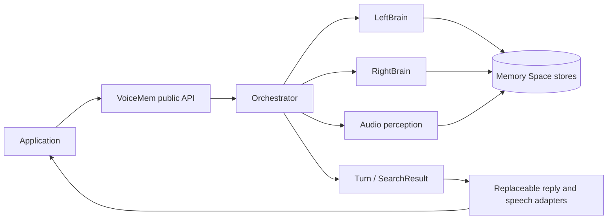
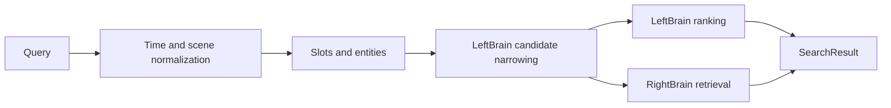
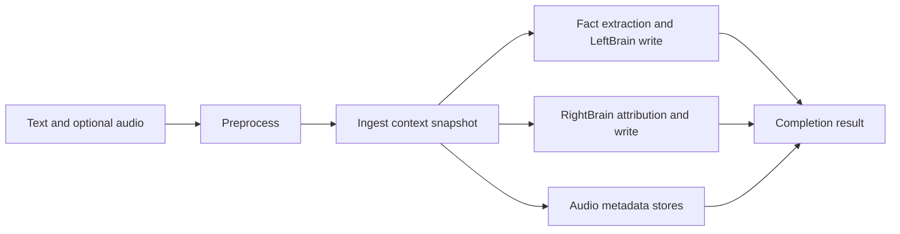
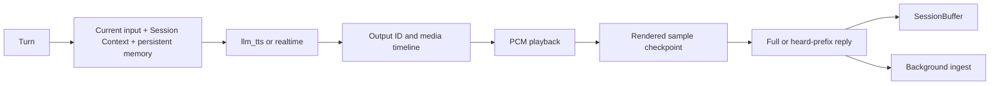

# VoiceMem Architecture Overview

This document describes the framework's current structure, data flows, state
ownership, and extension boundaries. It is a living design reference, not an
implementation log.

## 1. System role

VoiceMem is a memory framework for voice agents. It combines:

- factual memory and retrieval;
- affective and behavioral memory;
- optional audio-native perception;
- streaming turn preparation and speculative retrieval;
- replaceable model-backed capabilities.

Reply generation, speech synthesis, user interfaces, and transport are composed
around the memory framework. No single model or transport implementation defines
VoiceMem's memory semantics.



The dependency direction is inward: applications may depend on `voicemem`, but
the `voicemem` package does not depend on `web` or browser code.

## 2. Layer map

### Public API

`voicemem/core.py` exposes the `VoiceMem` facade. Its methods are thin delegates
to the owning subsystem. `voicemem/memory_api.py` provides convenience memory
helpers.

The public layer owns supported names and compatibility. It does not own search,
ingest, storage, or browser behavior.

### Orchestration

`voicemem/orchestrator.py` coordinates the memory domains and defines shared
result contracts:

- `Utils` lazily resolves injected capabilities;
- `SearchResult` combines factual and right-brain retrieval;
- `Orchestrator.Search` coordinates retrieval;
- `Orchestrator.Ingest` coordinates perception and persistence.

Domain algorithms and store details stay in their owning packages.

### Left brain

`voicemem/leftbrain/` owns factual memory:

- fact extraction and additive storage;
- embedding search and ranking;
- cognitive-graph slots and entity narrowing;
- relative-time expansion;
- summaries, subgraphs, and archival behavior.

### Right brain

`voicemem/rightbrain/` owns affective and behavioral memory:

- emotional episodes and attribution;
- traits, reactions, and situation patterns;
- retrieval directives;
- right-brain graph and experience storage.

The orchestrator is the coordination boundary between the two brains.

### Capabilities and providers

`voicemem/utils/defaults.py` defines lazy defaults. `voicemem/config.py` converts
declarative provider configuration into the same injection points accepted by
`VoiceMem`. `voicemem/llm_config.py` resolves process-level model roles and
credentials.

Capabilities include embedding, slot/schema classification, entity extraction,
emotion, voiceprint, ASR, VAD, memory storage, reply generation, and TTS.
Provider-specific SDK requests and responses are normalized before they reach
shared memory behavior.

### Streaming input

`voicemem/stream.py` owns input-turn state. `VoiceStream` accepts text, external
ASR partials, or PCM and emits:

- `StreamState` while a turn is active;
- `Turn` after the utterance is confirmed.

ASR, VAD, and speculative memory retrieval are coordinated in this layer.
Expensive audio perception fields remain lazy.

### Application and Web demo

`web/run.py` is the demo composition root. It combines Memory Space selection,
streaming input, session state, reply adapters, interruption, and memory
finalization.

`web/utils.py` owns FastAPI and WebSocket wiring. `web/voicemem.html` owns browser
capture and UI state. `web/pcm-player-worklet.js` owns PCM rendering.

`web/audio_timeline.py` tracks provider-neutral output time and heard-text
finalization. `web/session_context.py` tracks session-local turns that are not
represented by persistent memory. `voicemem/audio_timing.py` defines optional
TTS text-to-sample alignment contracts.

Reusable memory behavior belongs in `voicemem`. Demo policy, browser behavior,
and transport behavior belong in `web` or another application layer.

## 3. Mode model

Core memory modes and Web reply modes are independent.

### Core memory modes

| Mode | Capability profile |
| --- | --- |
| `left_brain_single` | Factual memory without emotion or audio perception |
| `text_mode` | Text memory with emotion-related memory logic |
| `multi_modal` | Text memory plus ASR, voiceprint, and audio perception |

### Web reply modes

| Mode | Output path |
| --- | --- |
| `llm_tts` | Text reply provider followed by a TTS provider |
| `realtime` | Speech-to-speech provider emitting transcript and audio |

The reply modes share memory results, session semantics, output identity,
interruption behavior, and heard-text finalization.

## 4. Core contracts

| Contract | Owner | Meaning |
| --- | --- | --- |
| `VoiceMem` | `core.py` | Public facade and component access |
| `SearchResult` | `orchestrator.py` | Combined left/right-brain retrieval |
| `Turn` | `stream.py` | Confirmed user text plus prepared memory result |
| `StreamState` | `stream.py` | Partial turn state and optional completed turn |
| `AudioPerception` | audio utilities | Normalized scene, speaker, and emotion evidence |
| `TimedAudioChunk` | `audio_timing.py` | Optional PCM chunk with text-to-sample alignment |
| `SessionTurn` | `web/session_context.py` | Unpersisted conversation state |
| `AudioTimeline` | `web/audio_timeline.py` | One assistant output's media and text timeline |

Provider adapters may add metadata, but shared consumers should depend on these
normalized meanings rather than vendor payload shapes.

## 5. Search flow



Left-brain ranking and right-brain retrieval may overlap when their inputs are
ready. The result contains normalized hits, classification, directives, and
timing data. Reply generation remains outside the search flow.

## 6. Ingest flow



`preprocess` resolves available audio evidence. The ingest context freezes the
turn, reply, user, language, and Memory Space used by later work.

With `async_facts=True`, persistence continues outside the caller's critical
path. The completion result indicates whether durable memory was created; a
conversation turn is not automatically a persistent memory.

## 7. Streaming turn flow

```text
text, ASR partial, or PCM
  -> update ASR/VAD state
  -> start or refresh speculative classify/search
  -> observe end-of-utterance silence
  -> confirm the final text
  -> emit Turn(text, SearchResult)
```

Speculation reduces post-utterance latency. Its result is provisional: cancelled
or stale work cannot replace final text or affect a later turn.

## 8. Reply and playback flow



The canonical Web media format is 24 kHz mono PCM16. Every assistant output has
an output ID and a sample-relative media clock.

Generated, sent, buffered, rendered, and heard output are distinct states.
Browser-rendered source samples determine the interruption cutoff. Text mapping
uses provider alignment when available, completed-segment duration otherwise,
and calibrated speech rate as the fallback.

## 9. Interruption flow

Interruption separates detection from commitment:

1. Acoustic activity during playback creates a candidate and pauses rendering
   without clearing buffered PCM.
2. ASR text, explicit control text, echo rejection, and backchannel handling
   confirm or reject the candidate.
3. Rejection resumes the preserved output.
4. Confirmation clears browser playback, cancels provider work, and prevents
   stale output from entering a newer turn.
5. The rendered sample cutoff produces the heard text prefix used by UI history,
   Session Context, memory attribution, and supported provider-side truncation.

The unplayed generated tail is diagnostic state, not conversation history.

## 10. Session and memory context

The reply model receives three logical inputs:

```text
current user input
+ unpersisted turns from the current WebSocket session and Memory Space
+ retrieved persistent memory
```

A completed or interrupted turn enters `SessionBuffer`. Background ingest
removes it only after the completion result confirms that persistent memory was
created. A non-persistent turn remains available until the session ends.

Session Context is isolated by WebSocket session and Memory Space. Background
work uses the `VoiceMem` instance captured when the work was scheduled, not a
later mutable active-space value.

## 11. State ownership

| State | Scope and owner | Lifetime |
| --- | --- | --- |
| Model-role configuration | Process, `llm_config.py` | Process |
| Lazy capability cache | `VoiceMem.Utils` instance | Instance/process |
| Factual and affective stores | Memory Space | Persistent |
| Streaming input state | `VoiceStream` | Input turn/session |
| Short-term dialogue | SessionBuffer key | WebSocket session + Memory Space |
| Output timeline | `AudioTimeline` | Assistant output ID |
| PCM queue | Browser AudioWorklet | Assistant output ID |
| Background ingest | Captured turn and `VoiceMem` | Until completion |

Process-level model configuration can affect more than one `VoiceMem` instance.
Turn-specific state therefore remains explicit and must not be inferred from a
mutable process global after scheduling.

## 12. Concurrency model

The asyncio event loop owns WebSocket I/O, turn transitions, output transitions,
and provider event routing. Synchronous inference, blocking I/O, and slow store
work run outside this loop.

Background work retains explicit task references, reports exceptions, respects
cancellation, and preserves Memory Space ownership. Writes to shared stores are
serialized when the store is not safe for concurrent mutation.

Parallelism is applied only after dependencies are satisfied. In search, for
example, right-brain retrieval and left-brain ranking may overlap after their
shared candidate context is ready.

## 13. Extension map

| Change | Owning location |
| --- | --- |
| Public convenience API | Thin facade plus the owning subsystem |
| Fact extraction or retrieval | `voicemem/leftbrain/` |
| Affective or behavioral memory | `voicemem/rightbrain/` |
| Cross-brain sequencing | `voicemem/orchestrator.py` |
| ASR, VAD, speaker, scene, or emotion component | `voicemem/utils/audio/` |
| Capability/provider construction | `voicemem/utils/defaults.py` and `voicemem/config.py` |
| Reply provider | `voicemem/reply.py` and config mapping |
| TTS provider | `voicemem/tts.py` and config mapping |
| Realtime output provider | Application adapter using normalized events |
| Browser UI, playback, or subtitles | `web/voicemem.html` and AudioWorklet |
| Output timing and heard prefix | `web/audio_timeline.py` and both reply adapters |
| Transport implementation | Application/transport layer |
| Persistent schema | Owning store plus an explicit migration path |

A cross-layer feature starts with a shared contract, then keeps each part inside
its owning layer.

## 14. Architecture update rule

Update this document when a change modifies:

- a layer's responsibility or dependency direction;
- a public or provider-neutral contract;
- a primary data flow;
- state ownership, isolation, or persistence;
- concurrency or cancellation semantics;
- the relationship between reply modes.

Implementation details, tuning values, incident history, and temporary
experiments do not belong in this overview.
