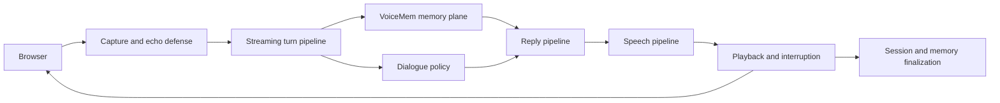
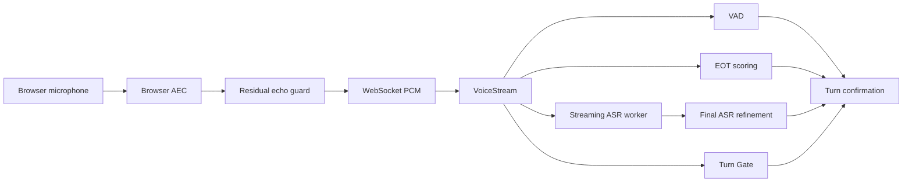
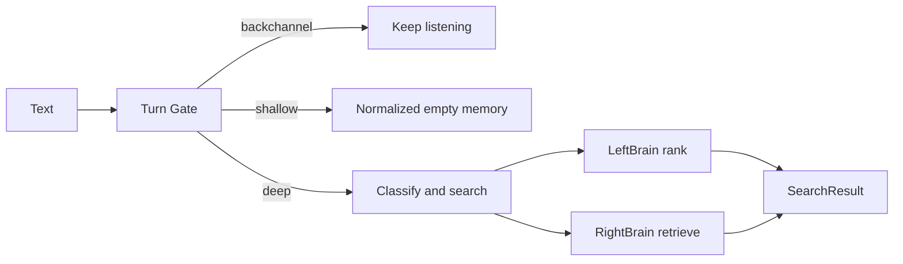
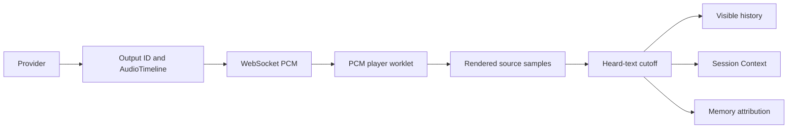

# VoiceMem Studio Architecture

This document describes the current Studio architecture, ownership boundaries,
runtime flows, and extension points. It is a design reference, not a development
log or benchmark report.

## 1. Product scope

VoiceMem Studio is a conversational voice application built around the
`voicemem` memory framework. The repository contains both:

- the reusable memory package; and
- a latency-oriented voice experience with browser capture, turn-taking,
  configurable prompts, local or remote reply models, speech synthesis,
  interruption, and observability.

The memory system does not depend on a particular reply model, speech provider,
or transport. Studio composes those concerns at the application boundary.



## 2. Architectural planes

### Client plane

Owned by `web/voicemem.html` and the AudioWorklets:

- microphone permission and browser audio graph;
- browser acoustic echo cancellation;
- residual playback-reference filtering in `mic-capture-worklet.js`;
- WebSocket text, PCM, and playback-checkpoint messages;
- PCM buffering and rendering in `pcm-player-worklet.js`;
- subtitles, Memory Space controls, and memory visualization.

The client reports rendered source-sample progress. Network receipt does not
mean that audio was heard.

### Conversation plane

Owned primarily by `web/run.py`, `web/harness.py`, and `harness/`:

- turn lifecycle and session wiring;
- unfinished-utterance handling;
- spoken backchannel policy and cached clips;
- tone-label parsing and TTS instruction selection;
- early reply buffering and commitment;
- interruption and output cancellation;
- short-term Session Context.

This plane may use memory results but does not define factual or affective
storage semantics.

The repository-only `harness/` layer separates four dialogue policy areas:

- `reply_modes/` owns the local post-ASR three-way reply router and reserves
  `memory_cot`, `memory`, and `direct` contracts;
- `persona/` reserves stable agent identity prompts;
- `speaking_style/` owns the active context-dependent depth and textual emotion
  arc instructions;
- `turn_taking/` owns the session state machine, backchannel curve, backchannel
  voice cache, and short-acknowledgement and long-work filler timing.

The persona folder and reply-path prompts are currently scaffolds. A local
Qwen3-0.6B router assigns internal `fast`, `medium`, or `slow` labels after
confirmed ASR and maps them to the three reply modes; stable mode identifiers
are consumed by the turn-taking state machine.
The Web composition root injects speaking-style prompts and executes the
state-machine decisions. Low-level pause detection and browser audio transport
remain in `web/run.py`.

### Memory plane

Owned by the reusable `voicemem` package:

- `core.py`: public `VoiceMem` facade;
- `orchestrator.py`: cross-component search and ingest workflows;
- `leftbrain/`: factual memory, vector retrieval, slots, entities, and time;
- `rightbrain/`: affective episodes, traits, reactions, and directives;
- `stream.py`: reusable streaming input and speculative retrieval;
- `memory_api.py`: prompt-ready memory helpers.

The package exposes normalized contracts and replaceable capabilities. It does
not depend on browser code.

### Inference and scheduling plane

Owned by provider modules and shared schedulers:

- `local_llm.py`: local MLX reply generation and prefix/KV caching;
- `tts.py`, `breeze_tts.py`, `breeze_fast.py`: speech providers and local
  synthesis support;
- `utils/gpu_loop.py`: the single process-level MLX execution thread;
- `utils/torch_lock.py`: serialization for shared Torch/MPS work;
- the streaming ASR worker and dedicated final-ASR executor in `stream.py`.

Provider adapters translate configuration and provider events into shared
reply, text, PCM, and timing contracts.

### Configuration and observability plane

Owned by:

- `web/harness.py`: Studio Web persona, context directives, and dialogue
  controls;
- `prompt/llm_*.md` and `prompt/llm_context.json`: package/default LLM prompt
  inputs;
- `prompt/tts.json`: TTS tone and backchannel synthesis configuration;
- `prompt_config.py`: validated prompt loading and caching;
- `prompt_trace.py`: asynchronous request tracing;
- `web/logging_utils.py`: runtime log routing;
- `evals/`: Studio behavioral and latency regressions.

Prompt traces may contain complete conversation and memory context. They are
runtime data even though their schema is part of the observability design.

## 3. Dependency direction

```text
browser / application
        -> conversation and provider adapters
        -> VoiceMem public API
        -> orchestrator
        -> left brain / right brain / audio capabilities
        -> stores and model adapters
```

Allowed cross-cutting infrastructure includes normalized contracts,
configuration, locks, schedulers, and logging. The memory package does not
import from `web` or the repository-only `harness` package.

## 4. Mode and provider model

Three independent choices shape a Studio run.

### Memory mode

| Mode | Memory capability profile |
| --- | --- |
| `left_brain_single` | Factual memory without affective/audio perception |
| `text_mode` | Text memory with affective memory logic |
| `multi_modal` | Text memory plus ASR, voiceprint, and audio perception |

### Reply mode

| Mode | Output path |
| --- | --- |
| `llm_tts` | Reply provider emits text; TTS provider emits PCM |
| `realtime` | Realtime provider emits transcript and PCM directly |

### Provider selection

Studio can select remote or local reply and TTS implementations. Provider
selection changes generation and scheduling details, not Session Context,
memory semantics, output identity, or heard-text finalization.

The local MLX profile has additional scheduling constraints described in
Section 10.

The reusable package targets Python 3.10 or newer. The current Studio local
profile and eval workflow are standardized on Python 3.12.

## 5. Core contracts

| Contract | Owner | Meaning |
| --- | --- | --- |
| `VoiceMem` | `voicemem/core.py` | Public memory facade |
| `SearchResult` | `voicemem/orchestrator.py` | Combined left/right retrieval |
| `Turn` | `voicemem/stream.py` | Confirmed user text and prepared memory |
| `StreamState` | `voicemem/stream.py` | Partial ASR/VAD/EOT state |
| Gate route | `voicemem/gate.py` | `backchannel`, `shallow`, or `deep` |
| `Pending` | `web/run.py` | Application-ready confirmed turn |
| `ReplySink` | `web/run.py` | Hidden speculative output timeline |
| `TimedAudioChunk` | `voicemem/audio_timing.py` | Optional PCM text alignment |
| `AudioTimeline` | `web/audio_timeline.py` | One output's text/media clock |
| `SessionTurn` | `web/session_context.py` | Unpersisted dialogue context |

Shared code consumes these meanings rather than provider-native objects.

## 6. Input and turn flow



### Capture

Browser AEC is the first echo-control stage. The microphone worklet receives a
playback reference and suppresses only highly correlated residual blocks. The
server-side text guard provides a second defense against assistant or
backchannel echo reaching ASR.

Capture batches target short, regular PCM frames. Capture and playback share a
sample-clock relationship so latency and echo logic can use explicit media
positions rather than wall-clock guesses.

### ASR and final refinement

Streaming ASR runs in a dedicated serial worker so chunk inference does not
block WebSocket input. At turn end, full-audio ASR refinement may run in a
separate final-ASR executor. Epoch checks prevent obsolete worker results from
overwriting a newer turn.

The complete captured audio remains available for archive and final decoding
even when obsolete streaming chunks are skipped.

### VAD, EOT, and pause policy

VAD provides acoustic speech/silence state. EOT provides semantic completeness
evidence. `PauseGate` applies Studio dialogue policy for unfinished phrases and
spoken backchannels. The timeout remains the fallback when semantic evidence is
not decisive.

These stages answer different questions and keep separate state:

- VAD: is speech acoustically active?
- EOT: does the utterance sound semantically complete?
- Pause policy: should Studio wait because the user may continue?
- final ASR: what is the best final transcript?

## 7. Turn Gate and memory retrieval

`voicemem/gate.py` assigns a confirmed utterance to one of three routes:

| Route | Interrupt active output | Inject factual memory |
| --- | --- | --- |
| `backchannel` | No | No |
| `shallow` | Yes | No |
| `deep` | Yes | Yes |

The gate combines a closed backchannel vocabulary, high-precision lexical
rules, and an embedding fallback. Its complete-utterance result is authoritative
for reusable core consumers. In the Studio `llm_tts` composition, it is also a
speculative retrieval hint; the post-ASR reply router owns the final decision to
inject memory into the reply.

For deep turns, speculative classify/search starts while speech is still in
progress. Query embedding work is shared within a search scope, and device
access follows the existing Torch lock boundary. A shallow or backchannel route
returns a normalized empty result rather than `None`.



## 8. Early reply generation

EOT can provide enough confidence to start reply work before final turn
confirmation. This is a latency optimization, not a change to turn semantics.

`ReplySink` initially buffers JSON events and PCM in one ordered private
timeline. Nothing reaches the browser until final ASR and turn confirmation
show that the speculative input still covers the final utterance.

```text
high EOT score
  -> freeze an immutable audio snapshot
  -> run final ASR for that snapshot in the background
  -> start speculative reply and TTS from the refined snapshot text
  -> buffer output in ReplySink
  -> finalize transcript and route
  -> compatible: commit buffered timeline and continue live
  -> incompatible: cancel provider work and discard the timeline
```

Cancellation removes stale reply, TTS, display, and GPU work before a new
response becomes authoritative.

The Web demo may use EOT to start speculative reply work. `VoiceStream` owns the
immutable audio snapshot and final-ASR refinement; `web/run.py` owns the policy
that starts LLM/TTS generation from the refined snapshot text. Streaming ASR
continues to update the browser while that work runs. ASR-only revisions during
silence do not rewrite the frozen prompt, but resumed speech cancels the buffered
work before any transcript or audio is sent. Generated speech stays buffered
until normal turn confirmation becomes the commit point for playback.

The Web pause gate does not add a second minimum to the configured turn
confirmation: a complete voice turn remains eligible at the application's EOT
or `confirm_s` boundary. Only a lexically unfinished clause, question preface,
short subject/time lead-in, or complement-taking tail gets a 1.2 second
continuation window. Resumed speech clears that window, so the completed
utterance again uses the normal confirmation latency. Until confirmation,
partial ASR remains transient UI state rather than a chat bubble. It may seed
buffered speculative work, but that work is cancelled if speech resumes and
cannot become an accepted reply before confirmation.

After confirmation, the local Qwen router selects exactly one reply mode:
`direct` (instant), `memory` (mem), or `memory_cot` (mem+cot). `direct` discards
any speculative memory result. The memory modes reuse an eligible speculative
result or complete retrieval before generation. A route change between an early
snapshot and final ASR invalidates buffered early output.

One session-scoped `TurnTakingStateMachine` then chooses the handoff. Ready
audio is released directly. An ordinary predicted wait may use a cached
acknowledgement, while only `memory_cot` may request an LLM-generated work
filler. First audio observations update the session estimate used by later
decisions. Main reply work runs into a `ReplySink` while either filler plays.
For every emitted end-of-turn filler, the browser reports actual playback
completion before that sink releases `answer_start` or main PCM. Generation
remains concurrent, but spoken filler and main audio never overlap or hard-cut
each other.

## 9. Reply, prompt, and speech flow

### Reply context

The reply input combines:

```text
Studio system prompt
+ current user input
+ recent session history
+ route-eligible persistent memory
+ contextual directives
```

Reply mode is one per-turn signal rather than an independent memory and thinking
pair. The local router runs outside the WebSocket loop under the process Torch
lock. Chinese input uses a Chinese routing policy. Provider-neutral request
options carry the required reasoning across async reply iteration: `direct` and
`memory` use non-thinking generation, while `memory_cot` uses high effort.
Reasoning content remains private and is never spoken.

`build_reply_context` is the shared context builder used by actual generation
and local-model prewarming. Keeping one builder preserves local prefix-cache
compatibility.

### Prompt ownership

The Studio Web system prompt and dialogue context live in `web/harness.py`.
Package/default prompt files live in `prompt/llm_*.md` and
`prompt/llm_context.json`. TTS tone configuration is loaded from
`prompt/tts.json`.

Prompt configuration is parsed and cached by `prompt_config.py`; malformed or
incomplete configuration fails validation rather than changing behavior
silently. Runtime changes require restart because prompt files are not read in
the speech loop.

### Tone and TTS

The reply model may prefix text with a tone tag. `voicemem/tts_control.py` removes
that control tag, smooths abrupt tone transitions, and converts it into a TTS
instruction. Control tags are never spoken or stored as assistant text.

The TTS layer accepts plain 24 kHz mono PCM16 bytes and optional
`TimedAudioChunk` alignment metadata. Segment concurrency is selected by the
provider; local GPU providers can require serialized segments.

### Spoken backchannels

`harness/turn_taking/backchannel.py` decides whether to emit a short acknowledgement during
a user pause and selects a token appropriate to language and context. Audio is
served from reviewed or prepared clips because generation on the live pause
window is too late. Backchannels share playback and echo-reference plumbing but
do not become normal assistant replies.

## 10. Local inference scheduling

### MLX

Local MLX reply and TTS work share one process-level `GpuLoop`. The loop owns the
GPU execution thread and advances active generators in weighted turns.

Some speech jobs receive temporary first-chunk priority; afterward they rejoin
weighted scheduling. Cancellation closes the generator and removes it from the
active set. Creating an independent MLX thread or stream bypasses this safety
and scheduling model.

### Torch/MPS

Torch-backed embedding and related MPS operations use the process-level lock in
`utils/torch_lock.py`. Lock scope covers device inference, not unrelated search
coordination or waits on work that may need the same lock.

### Hot-path priority

Studio tracks whether reply or speech output is on the user-visible hot path.
Background perception and ingest may wait for an idle window, subject to a
bounded fallback so memory work cannot starve indefinitely.

## 11. Output, playback, and interruption



The canonical Web media format is 24 kHz mono PCM16. Each assistant output has
an output ID. Late audio, subtitle, checkpoint, and cancellation events resolve
against that ID.

The local Breeze adapter emits an initial acoustic batch sized to satisfy the
browser's existing admission buffer in one delivery. This avoids a redundant
one-frame codec call and the subsequent wait for a second server chunk without
raising the browser prebuffer or delaying audible playback.

Turn fillers use the browser's independent backchannel path so they do not
become main-output timeline content. End-of-turn fillers are interruptible:
barge-in and reset may stop them, but an ordinary handoff waits for the browser's
playback-complete event before releasing main PCM. In-speech
backchannels remain independent and do not mutate the main reply state.

Generated, sent, buffered, rendered, and heard output are distinct states.
Browser-rendered source samples determine the interruption cutoff. Text mapping
uses provider alignment when available, completed-segment duration otherwise,
and calibrated speech rate as the fallback.

Interruption separates reversible detection from cancellation:

1. Candidate speech pauses playback while preserving the PCM queue.
2. ASR growth, explicit control text, backchannel routing, and echo rejection
   confirm or reject the candidate.
3. Rejection resumes the same output.
4. Confirmation clears browser playback, cancels reply/provider work, and
   finalizes only the heard assistant prefix.

Generated, sent, buffered, rendered, and heard output are different states. The
unheard generated tail is not conversation history.

## 12. Session and persistent memory

Session Context contains turns not yet represented by persistent memory. It is
isolated by WebSocket session and Memory Space.

```text
current user input
+ unpersisted Session Context
+ retrieved persistent memory
-> reply provider
```

After a normal or interrupted reply, ingest runs outside the response path.
The completion callback removes the session turn only when durable memory was
created. Non-persistent dialogue remains until the session ends.

Background ingest captures the target `VoiceMem` instance and Memory Space when
scheduled. A later UI space change cannot redirect an existing write.

## 13. State ownership

| State | Owner | Lifetime |
| --- | --- | --- |
| Model-role and provider configuration | Process configuration | Process |
| Prompt templates and parsed prompt cache | Harness / prompt config | Process |
| MLX scheduler | `GpuLoop` | Process |
| Torch device serialization | `TORCH_LOCK` | Process |
| `VoiceMem` capability cache | `VoiceMem` instance | Instance |
| Factual and affective memory | Memory Space stores | Persistent |
| Streaming ASR/VAD/EOT/gate state | `VoiceStream` | Input turn/session |
| Turn-taking phase, latency estimate, and backchannel policy | `TurnTakingStateMachine` | WebSocket session |
| Reply router model | `harness/reply_modes` | Process |
| Reply mode | Confirmed `Pending` turn | Turn |
| Early output buffer | `ReplySink` | Speculative assistant output |
| Short-term dialogue | `SessionBuffer` | WebSocket session + Memory Space |
| Text/media alignment | `AudioTimeline` | Assistant output ID |
| PCM queue and echo reference | Browser worklets | Assistant output ID/session |
| Background ingest | Captured turn and `VoiceMem` | Until completion |

Turn-specific state is explicit. Process globals are reserved for configuration,
shared model caches, and schedulers whose process-wide behavior is intentional.

## 14. Observability and evaluation

Studio has three distinct verification categories:

- deterministic Python regressions in `tests/` and `evals/test_*.py`;
- browser/worklet simulations in `evals/*.cjs`;
- latency, quality, and benchmark scripts in other `evals/` files and
  `evaluation/`.

`prompt_trace.py` records allowlisted provider requests asynchronously so disk
I/O does not block speech. `prompt/logs/` entries can include system prompts,
history, and retrieved memory; they are sensitive runtime traces.

Synthetic regressions verify state transitions and protocol behavior. Live
perceived latency, voice quality, Metal stability, microphone behavior, and
network-provider performance require the corresponding native environment.

## 15. Extension map

| Change | Primary owner |
| --- | --- |
| Public memory API | Thin facade plus owning memory subsystem |
| Fact extraction or retrieval | `voicemem/leftbrain/` |
| Affective or behavioral memory | `voicemem/rightbrain/` |
| Cross-brain search or ingest | `voicemem/orchestrator.py` |
| ASR, VAD, EOT, speaker, scene, emotion | `voicemem/utils/audio/` and config |
| Turn routing | `voicemem/gate.py` and streaming regressions |
| Studio persona or pause policy | `web/harness.py` |
| Spoken backchannel behavior | `harness/turn_taking/` and Web playback |
| Tone-label protocol | `voicemem/tts_control.py`, prompts, and TTS wiring |
| Reply provider | `voicemem/reply.py` or `local_llm.py`, then config |
| Three-way reply routing | `harness/reply_modes/` and Web composition root |
| TTS provider | `voicemem/tts.py` or provider module, then config |
| GPU scheduling | `voicemem/utils/gpu_loop.py` |
| Prompt parsing | `voicemem/prompt_config.py` and `prompt/` schema |
| Prompt tracing | `voicemem/prompt_trace.py` |
| Early generation | `ReplySink`, EOT callback, and cancellation path |
| Capture echo control | Browser mic worklet and server echo guard |
| Playback timing and heard prefix | Audio timeline and both reply modes |
| Browser UI and visualization | `web/voicemem.html` |
| Transport | Application boundary; memory contracts remain stable |
| Persistent schema | Owning store plus explicit migration and rollback |

A cross-layer feature begins with a normalized contract. Each implementation
then remains in its owning layer.

## 16. Architecture update rule

Update this document when a change modifies:

- a layer's responsibility or dependency direction;
- a public or provider-neutral contract;
- input, reply, playback, interruption, or persistence flow;
- state ownership, isolation, cache, or lifetime;
- GPU, thread, lock, or cancellation semantics;
- prompt ownership or the relationship between reply modes.

Tuning values, local machine observations, incident history, and temporary
experiments belong in focused evaluation artifacts, not this overview.
