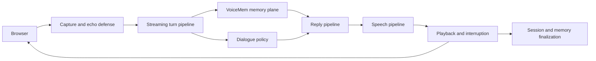
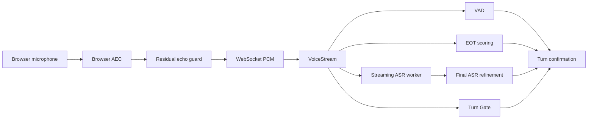
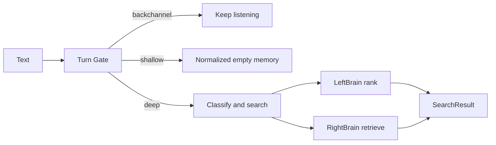
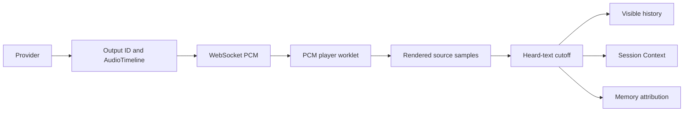

# VoiceMem Studio Architecture

This document describes the current Studio architecture, ownership boundaries,
runtime flows, and extension points. It is a design reference, not a development
log or benchmark report.

## 1. Product scope

VoiceMem Studio is a conversational voice application built around the
`voicemem` memory framework. The repository contains both:

- the reusable memory package; and
- a latency-oriented voice experience with browser capture, turn-taking,
  configurable prompts, local or remote reply models, speech synthesis,
  interruption, and observability.

The memory system does not depend on a particular reply model, speech provider,
or transport. Studio composes those concerns at the application boundary.



## 2. Architectural planes

### Client plane

Owned by `studio/apps/ui/`, `studio/web/transport.py`, and the AudioWorklets:

- microphone permission and browser audio graph;
- browser acoustic echo cancellation;
- residual playback-reference filtering in `mic-capture-worklet.js`;
- WebSocket text, PCM, and playback-checkpoint messages;
- PCM buffering and rendering in `pcm-player-worklet.js`;
- subtitles, Memory Space controls, and memory visualization.

The client reports rendered source-sample progress. Network receipt does not
mean that audio was heard.

### Conversation plane

Owned by `studio/core/voiceagent.py`, its `utils/` modules, and `studio/harness/`:

- turn lifecycle and session wiring;
- unfinished-utterance handling;
- spoken backchannel policy and cached clips;
- tone-label parsing and TTS instruction selection;
- allowlisted, conversation-scoped Self Harness overlays selected by the reply model;
- early reply buffering and commitment;
- interruption and output cancellation;
- short-term Session Context.

This plane may use memory results but does not define factual or affective
storage semantics.

The four policy files in `studio/harness/{persona,speaking_style,reply_modes,
turn_taking}/policy.py` are immutable runtime defaults. Each exposes its
pre-Self-Harness prompt as a `DEFAULT_*` value, and execution remains in the
corresponding `studio/core/utils/` component. Studio uses one prompt per purpose
without language variants. `--lang` still selects ASR and Memory Space language;
the memory library retains its own prompt inputs.

`studio/harness/self_harness/policy.py` is the fifth, coordinating policy. It
declares a typed overlay schema spanning persona interaction style, speech rate,
tone, reply length, reasoning depth, spoken backchannel frequency, and work
filler behavior. The same reply call emits a private `<self_harness>` JSON
prefix before its tone tag. The reply pipeline removes that prefix, rejects
unknown domains, fields, values, and changes larger than two fields, and stores
accepted changes on the current WebSocket `Conversation`. It never rewrites the
four default prompts, Python source, provider settings, or arbitrary runtime
parameters.

Self Harness changes are small session overlays. The model may emit them only
for explicit user preferences; transient content cannot change the profile.
Current profile context marks fields changed during the preceding two replies.
A conflicting request in that window is emitted as a candidate but staged by
the runtime instead of being activated. The model asks for confirmation; only
the same candidate repeated on the next explicit request is applied. This
hysteresis is enforced for the stored profile and the current reply's TTS, while
relative speech-rate requests move only one step. The runtime also enforces the
schema and per-turn change bound independently of the prompt.
Speech rate is appended to request-scoped TTS instructions, reasoning preference
is composed with Gate memory eligibility, and turn-taking preferences mutate
only the session state machine. Speculative replies stage their entire update
and apply it only when that reply is committed, so a discarded EOT prediction
cannot alter later turns. Realtime speech-to-speech prompts do not use this text
control protocol.

The local Qwen3-0.6B classifier selects ordinary or deep reasoning after ASR.
Studio combines that depth with VoiceMem memory eligibility into the existing
`fast`, `medium`, or `slow` reply modes. Missing default weights are downloaded into the
`studio/models/reply-router/Qwen3-0.6B` directory with visible progress.
Explicit model paths remain caller-owned.

`studio/core/core.py` exposes service setup and the chronological controls:
listen, merge continuation, stop warming, wait on unfinished speech, route,
interrupt, commit early output or start a reply, and cancel on disconnect.
`VoiceAgent` composes application utilities. `Conversation` owns per-WebSocket
state and tasks explicitly; utility methods implement each control without
moving model inference onto the event loop. GPU and Torch schedulers remain
process-scoped. Speculative generation captures its memory instance and space
before scheduling; cancellation also reaps pending route work.

Interactive startup without `--llm` asks once for DeepSeek, Qwen, OpenAI, or an
MLX-local reply model before loading inference. Remote selections are shared by
VoiceMem memory work and visible Studio replies; the local reply option uses
DeepSeek for memory work. Explicit `--llm`, `--check`,
realtime mode, and non-interactive commands never prompt. Non-interactive startup
defaults to DeepSeek reply, Breeze TTS, and the `studio-zh` Memory Space.
An explicit `--space` selects another existing or new space; stored language and
memory data are preserved when the default selection changes.
Qwen is selectable with `--llm qwen`: `qwen3.6-flash` uses the international
DashScope OpenAI-compatible endpoint with streamed content and request-scoped
thinking. Credentials come from `DASHSCOPE_API_KEY` or ignored `.env.qwen`;
ordinary replies disable thinking, while deep reasoning preserves the router's
selection. Memory workers and display rewriting use the selected memory model.
Startup reports missing credentials, dependencies, versions, assets, policies,
and weights before opening memory.
Repository `.env` files supply credentials and deployment options without overriding
exported environment variables. Both platforms use `python -m studio` after
activating their separately installed environment; `python web/run.py` remains
the compatibility entry point. Optional `scripts/run_studio_cuda.sh` and
`scripts/run_studio_mlx.sh` select the corresponding interpreter and backend,
enable verbose terminal logging, and forward arguments to that same entry point.
The backend defaults to CUDA on Linux and MLX on macOS, with CUDA devices
defaulting to `cuda:0`. Environment variables and explicit CLI flags remain
optional overrides for the backend and ASR/router or TTS device. Complete legacy weights are linked
into `studio/models/`; missing artifacts download there with resumable caching.
The DeepSeek provider is also passed into VoiceMem's internal extraction,
annotation, and cleanup workers, so their model and endpoint cannot fall back to
an OpenAI model name.
The MLX extra pins Transformers 5.16.1 with Hugging Face Hub 1.x to satisfy
MLX Audio 0.5.1. The separate CUDA extra pins Torch 2.8.0, Transformers 4.57.3,
Hub 0.x and qwen-tts 0.1.1 for the native Breeze streaming runtime.
The memory package accepts Transformers 4.52.3 through 5.x;
its recognition and reply contracts remain unchanged.
Selected model warmup failures prevent serving a silently degraded pipeline.
`--check` performs inspection only. Model directories contain weights, while
model classes and factories live in `core/utils/<component>/`.

### Deployment boundary

Linux/NVIDIA deployment uses `compose.yaml` and `docker/Dockerfile.cuda` to run
the same Studio entry point and in-process Breeze provider. The image pins the
independent Breeze source revision and CUDA dependency profile. The default
image tag is `voicemem-studio:torch2.8-cu128`, with Torch/TorchAudio 2.8.0,
TorchVision 0.23.0 and CUDA 12.8 validated during the build. The host retains
ownership of its NVIDIA driver. Model weights are acquired at runtime.
Only GPU 0 is exposed to the container. The process
runs as a non-root user with an init process; memory, results, request logs,
model weights and compiler/download caches live in separate persistent volumes.
The harness directory and TTS JSON are read-only configuration mounts, loaded on restart.
Credentials are runtime configuration, never image build inputs. Build-context
filters exclude private traces, memory, recordings, checkpoints and host environments.
The default published port is loopback-only; exposing the application requires
deployment-level HTTPS and access control. HTTP health becomes available only
after the existing model warmup completes.
Native command-line startup also binds loopback by default. The CUDA container
explicitly binds `0.0.0.0` inside its isolated network namespace so Compose can
publish the service on the host's loopback address.

Apple Silicon retains native MLX deployment through the existing launch script;
`scripts/setup_studio_mlx.sh` prepares the matching environment without replacing
an existing environment or credential file. No Metal-in-Linux-container path or
host inference proxy is added. Neither deployment changes memory semantics,
provider contracts, speech segmentation or model scheduling.
`npm start` is the canonical source entry and runs setup only when the environment
marker is absent or the dependency definition changed. `scripts/start_studio_app.sh`
is a compatibility alias. The lower-level setup and backend launchers remain
available independently.
The native setup also installs the locked desktop-pet dependencies. Headless
containers disable spawning Electron through `STUDIO_DESKTOP_PET=0` while
retaining the upstream pet-observer WebSocket and events. Linux, including WSL,
never auto-spawns the desktop pet even when the environment flag is enabled.
Native macOS launches keep the optional automatic pet lifecycle by default.

`studio/core/voicemem.py` is the integration boundary for creating VoiceMem and
opening its native stream. The current deployment is one process: memory is
initialized before Studio starts accepting connections. There is no memory RPC
server or second startup command. Streaming ASR, final ASR, VAD, EOT, and their
worker/epoch guards remain in VoiceMem because the memory package also uses them.
`studio/core/utils/asr/` initializes shared recognizers from Studio weight paths.

`studio/web/` owns browser assets, HTTP/WebSocket transport, and the pet bridge.
`studio/apps/` owns the Windows/macOS Electron desktop client and pet. Linux is
a backend deployment target, not a desktop release target. Windows runs capture,
playback and the pet natively, while local CUDA inference belongs in WSL2 or its
Docker backend. macOS uses native MLX or a remote service. Both clients share
the same Web UI and observer contracts. The backend root serves the shared
frontend from `studio/apps/ui/`, with assets under `/ui/`. Its first page reuses the original mode-selection homepage, with labeled
image cards linking to the technical or digital-human visual style. Display
settings live inside each style. The component settings tab presents the fixed
input, memory, reply, speech, and pet components as a draggable canvas. Only
normalized card positions are stored in browser local storage; components cannot
be removed. `/api/components` supplies non-secret provider, model, endpoint, and
readiness labels. For an App-owned backend, a narrowly scoped isolated preload
allows the main-frame settings page to update the memory or reply model service
and request a supervised backend restart. The main process validates endpoints,
keeps keys out of command arguments and backend responses, and encrypts persisted
keys with Electron `safeStorage`. A new configuration is persisted only after its
backend becomes ready; failure restarts the previous configuration. Existing or
remote services remain read-only because their lifecycle belongs to the server.
`/legacy` retains the previous Studio renderer;
`/classic` retains the older demo. The desktop opens this same root and keeps its
connection configuration window hidden on a successful startup; connection errors
reveal configuration. Desktop clients require the updated backend assets.

`studio-client.js` owns one page-local WebSocket and AudioContext, reuses the
existing capture and PCM AudioWorklets, and sends rendered-sample checkpoints,
actual playback RMS levels, pause/resume, and filler completion on the existing
protocol. The RMS event feeds the App-owned Live2D pet and is not treated as a
playback checkpoint. The client retains a bounded, memory-only PCM cache for
completed replies so the reply speaker control replays the audio that the
backend actually generated. Interrupted replies retain only the source samples
reported as rendered by the playback worklet. Replays do not emit playback
checkpoints and the cache is discarded on page refresh. UI replies and
perception come from backend events. Confirmed input IDs deduplicate transcripts
and merge continuations; interruption uses the backend's heard prefix. Changing
style, conversation, language, or leaving the page closes its connection. Chat
lists are page-local and reset on refresh; opening a previous list item starts a
new backend context for subsequent input. The supplied brain illustration is a
memory-domain navigation diagram, not a count or topology of stored memories.
The panels show real per-turn recall results without demo records or rule replies. A local
configuration page owns connection IPC. The Studio renderer has only the model-service
bridge described above and no Node integration. Both renderers use context isolation and
sandboxing. Microphone requests are limited to main-frame audio from the selected
origin and require user approval; remote connections require HTTPS, while HTTP
is accepted only on loopback. Settings and browser state live in the desktop
application-data directory, not in the backend's memory or credential files.

The source desktop entry (`npm start`) first prepares a missing or stale Apple
Silicon Python environment, then verifies its locked Electron, PixiJS,
and Pixi Live2D files. Missing files trigger `npm ci --include=dev`; a complete
installation performs no package-manager or network work. The managed install
explicitly enables lifecycle scripts so a user-level npm `ignore-scripts`
setting cannot leave Electron without its platform binary. It then owns an optional local backend lifecycle.
The separate `npm run start:remote` entry performs the same locked client-resource
preparation but removes managed-backend state before Electron starts. It opens
the connection configuration immediately, without first waiting on the default
loopback service and without checking local Python, WSL, accelerators,
credentials, or inference models. This is the source entry for Intel Macs,
clients without a compatible local GPU, and already running local or remote services.
Before Electron starts it asks once for a provider and reads one matching API
key with masked terminal input when no encrypted App model configuration exists.
Later launches reuse the App configuration without another terminal prompt.
Remote selections and their key are shared by
VoiceMem memory work and visible Studio replies. The local MLX reply selection
uses the same single prompt for the DeepSeek key required by memory work and
conversation titles. A
short-lived preparation process checks and acquires the shared memory,
perception, and transcription models. Keys are inherited only by preparation,
Electron, and the backend process, never command arguments. After the first
backend reaches readiness, Electron persists them only through OS-backed
`safeStorage`; the connection settings file remains secret-free.
Electron starts `.venv/bin/python` with the MLX backend on macOS, or invokes
`.venv-cuda/bin/python` through `wsl.exe` with the CUDA backend on Windows. Both
paths bind loopback port 8787, disable the backend-owned pet, acquire the
remaining reply and speech models, run strict warmups, wait for the shared Web
page for up to 30 minutes by default, and only then create and show the style selector.
The timeout can be increased for unusually slow first downloads through the
desktop launch environment. Existing-service connections retain their shorter
readiness timeout. Managed startup never
creates the local connection/status window; preparation progress stays in the
terminal, and startup failures use a native error dialog. The app stops this
owned process on exit. Missing Python, WSL, driver, or dependency prerequisites produce a startup
error; model artifacts are checked and downloaded with resumable provider
caches. The desktop entry does not install or modify system components.

On Windows, an opt-in configuration setting can also start an existing local NVIDIA
Compose service through a local Docker named pipe. Docker Desktop must already
be running with its WSL2 backend; the app never starts or installs the Docker
engine or WSL itself. The Unix-socket path remains available to isolated Linux
development tests, not as a Linux desktop release. Startup uses the user-approved project and optional local override,
never builds or pulls an image or recreates an existing container, reads the published port and waits for the Web
page to become ready. Connection attempts own cancellable CLI and readiness
work; stale attempts cannot replace a newer window. Closing the app never stops
the shared container. Installed desktop packages can still connect to an already
running local or remote service; the source-managed backend requires the repository
and its prepared Python environment. There is no Metal-in-Docker path. Desktop packages contain the shell, Electron
runtime and pet display resources, not inference weights, Python, recordings,
credentials or memory data.

The desktop app also owns one optional transparent pet window in the same
Electron application. Packaging selects the existing `pet/` renderer, animation,
observer, rattan/white-vine Cubism model, expressions and Pixi runtime without forking them or
bundling another Electron. The generated HTML connection CSP is adapted for the
desktop package, and the pet session permits the Cubism Core source plus the
selected observer. Resource preparation backs up recognized Canvas and older
Live2D build output before migration, excludes backups from the package, and
rejects unknown files. Its isolated preload exposes window controls,
not Docker or settings APIs; IPC validates the pet's exact main frame and document.
The pet session permits bundled resources, the Cubism Core source and the selected
`/ws-pet` endpoint and denies device permissions. Its call button sends a trusted,
main-frame-only IPC request to toggle the existing Studio page's voice control with
a user gesture; the App renderer retains microphone permissions, capture, playback,
and conversation ownership. Desktop voice capture may continue while the App window
is hidden, but page navigation, settings, and explicit stop still end it. Service changes close
the old observer before opening the new one; closing the Studio window closes the
pet. Position and a 40–150% expanded-window scale live in desktop app data; older
position-only files default to 100%. The shared renderer uses a portrait call
background, a single voice toggle and a collapse button, without numbered action
controls. Dragging any of its four corners resizes around the opposite corner, and
dragging the character or background moves the window. Window controllers constrain bounds to
the display work area and resize without restarting the avatar pose. The dot
keeps its fixed size, and manual collapse suppresses observer-triggered expansion
until the user explicitly reopens it. Opening or focusing Studio leaves pet
placement under user control. The standalone controller provides the same controls
with its own saved position and scale. Native users can disable the backend's
automatic pet with the existing `STUDIO_DESKTOP_PET=0` to avoid duplicate windows;
containers already do this. The standalone launch and Web playback contracts remain unchanged.

Original `web/run.py`
and moved provider modules remain thin compatibility entry points; executable
Studio implementations have one owner under `studio/`.

### Memory plane

Owned by the reusable `voicemem` package:

- `core.py`: public `VoiceMem` facade;
- `orchestrator.py`: cross-component search and ingest workflows;
- `leftbrain/`: factual memory, vector retrieval, slots, entities, and time;
- `rightbrain/`: affective episodes, traits, reactions, and directives;
- `stream.py`: reusable streaming input and speculative retrieval;
- `memory_api.py`: prompt-ready memory helpers.

The package exposes normalized contracts and replaceable capabilities. It does
not depend on browser code.

### Inference and scheduling plane

Owned by provider modules and shared schedulers:

- `studio/core/utils/llm/local.py`: local MLX reply generation and prefix/KV caching;
- `studio/core/utils/tts/providers.py`, `component.py`, `cache.py`: speech providers and local
  synthesis support;
- `utils/gpu_loop.py`: the single process-level MLX execution thread;
- `utils/torch_lock.py`: serialization for shared Torch/MPS work;
- the streaming ASR worker and dedicated final-ASR executor in `stream.py`.

Provider adapters translate configuration and provider events into shared
reply, text, PCM, and timing contracts.

### Configuration and observability plane

Owned by:

- `studio/harness/`: Studio Web persona, context directives, and dialogue
  controls;
- `prompt/llm_*.md` and `prompt/llm_context.json`: package/default LLM prompt
  inputs;
- `prompt/tts.json`: TTS tone and backchannel synthesis configuration;
- `prompt_config.py`: validated prompt loading and caching;
- `prompt_trace.py`: asynchronous request tracing;
- `studio/core/utils/logging_utils/component.py`: runtime log routing;
- `evals/`: Studio behavioral and latency regressions.

Prompt traces may contain complete conversation and memory context. They are
runtime data even though their schema is part of the observability design.

## 3. Dependency direction

```text
browser / application
        -> conversation and provider adapters
        -> VoiceMem public API
        -> orchestrator
        -> left brain / right brain / audio capabilities
        -> stores and model adapters
```

Allowed cross-cutting infrastructure includes normalized contracts,
configuration, locks, schedulers, and logging. The memory pipeline does not import Studio. Legacy explicit TTS and local-reply
imports lazily resolve to Studio adapters, preserving provider injection and a
single provider cache. Plain `import voicemem` does not load Studio or models.

## 4. Mode and provider model

Three independent choices shape a Studio run.

### Memory mode

| Mode | Memory capability profile |
| --- | --- |
| `left_brain_single` | Factual memory without affective/audio perception |
| `text_mode` | Text memory with affective memory logic |
| `multi_modal` | Text memory plus ASR, voiceprint, and audio perception |

### Reply mode

| Mode | Output path |
| --- | --- |
| `llm_tts` | Reply provider emits text; TTS provider emits PCM |
| `realtime` | Realtime provider emits transcript and PCM directly |

### Provider selection

Studio can select remote or local reply and TTS implementations. Provider
selection changes generation and scheduling details, not Session Context,
memory semantics, output identity, or heard-text finalization.

The local MLX profile has additional scheduling constraints described in
Section 10.

The reusable package targets Python 3.10 or newer. The current Studio local
profile and eval workflow are standardized on Python 3.12.

## 5. Core contracts

| Contract | Owner | Meaning |
| --- | --- | --- |
| `VoiceMem` | `voicemem/core.py` | Public memory facade |
| `SearchResult` | `voicemem/orchestrator.py` | Combined left/right retrieval |
| `Turn` | `voicemem/stream.py` | Confirmed user text and prepared memory |
| `StreamState` | `voicemem/stream.py` | Partial ASR/VAD/EOT state |
| Gate route | `voicemem/gate.py` | `backchannel`, `shallow`, or `deep` |
| `Pending` | `studio/core/utils/contracts/component.py` | Application-ready confirmed turn |
| `ReplySink` | `studio/core/utils/contracts/component.py` | Hidden speculative output timeline |
| `TimedAudioChunk` | `studio/core/utils/tts/audio_timing.py` | Optional PCM text alignment |
| `AudioTimeline` | `studio/core/utils/audio_timeline/component.py` | One output's text/media clock |
| `SessionTurn` | `studio/core/utils/session_context/component.py` | Unpersisted dialogue context |

Shared code consumes these meanings rather than provider-native objects.

Input display messages use an opaque `input_turn_id`, distinct from assistant
`output_id` and persistent history IDs. Capture retains it across partials and
the accepted input, then rotates it for the next turn. An explicit continuation
merge includes `replace_input_turn_id` so the UI updates the original user bubble
instead of guessing from elapsed time. Untagged events retain legacy display
behavior. These identifiers carry no memory-write or interruption authority.

## 6. Input and turn flow



### Capture

Browser AEC is the first echo-control stage. The microphone worklet receives a
playback reference and suppresses only highly correlated residual blocks. The
server-side text guard provides a second defense against assistant or
backchannel echo reaching ASR.

Capture batches target short, regular PCM frames. Capture and playback share a
sample-clock relationship so latency and echo logic can use explicit media
positions rather than wall-clock guesses.

The browser owns one live connection attempt and its microphone resources.
Startup is registered before opening the WebSocket; another start-button click
cancels that attempt instead of creating a second capture. Every asynchronous
startup continuation checks its owner, and late permission results have their
tracks stopped. End/disconnect/page exit invalidates ownership before removing
node callbacks, disconnecting the capture and playback-reference edges, stopping
tracks and closing the owned socket. PCM callbacks use the socket and sample
clock captured by their own attempt, never a later connection. AudioWorklet
module loading may be shared for one audio context, but capture nodes are not.
The ScriptProcessor fallback follows the same cleanup and ownership rules.
Old socket events and cancelled startup-memory responses cannot affect the new
session. This is a per-page guard, not a cross-client or server-wide session limit.

### ASR and final refinement

Streaming ASR runs in a dedicated serial worker so chunk inference does not
block WebSocket input. At turn end, full-audio ASR refinement may run in a
separate final-ASR executor. Epoch checks prevent obsolete worker results from
overwriting a newer turn.

ASR finalization gives full-audio refinement an 80 ms preference window, then
accepts the first non-empty result from refinement or streaming flush. Passing
the preference window does not cancel refinement while streaming is unfinished.
The two decoders share a one-second finalization deadline, including queue time;
if neither produces usable text, the last available transcript is retained and
the streaming worker advances its epoch to discard stale work. Timeout fallbacks
are logged even when detailed ASR timing is disabled. Standalone offline probes
and speculative snapshots use the same one-second wait limit. Cancelling a wait
does not forcibly terminate native inference, but late results cannot update
turn text. These limits bound ASR waits, not VAD turn detection, memory retrieval,
reply generation or playback.

The complete captured audio remains available for archive and final decoding
even when obsolete streaming chunks are skipped.

### VAD, EOT, and pause policy

VAD provides acoustic speech/silence state. EOT provides semantic completeness
evidence. `PauseGate` applies Studio dialogue policy for unfinished phrases and
spoken backchannels. The timeout remains the fallback when semantic evidence is
not decisive.

These stages answer different questions and keep separate state:

- VAD: is speech acoustically active?
- EOT: does the utterance sound semantically complete?
- Pause policy: should Studio wait because the user may continue?
- final ASR: what is the best final transcript?

## 7. Turn Gate and memory retrieval

`voicemem/gate.py` assigns a confirmed utterance to one of three routes:

| Route | Interrupt active output | Inject factual memory |
| --- | --- | --- |
| `backchannel` | No | No |
| `shallow` | Yes | No |
| `deep` | Yes | Yes |

The gate combines a closed backchannel vocabulary, high-precision lexical
rules, and an embedding fallback. Its complete-utterance result owns baseline
memory eligibility, including in Studio `llm_tts`. The depth classifier cannot
veto a Gate-approved memory turn. Deep reasoning can additionally request memory
to preserve the existing `memory_cot` mode. Speaker privacy still takes priority.

For deep turns, speculative classify/search starts while speech is still in
progress. Query embedding work is shared within a search scope, and device
access follows the existing Torch lock boundary. A shallow or backchannel route
returns a normalized empty result rather than `None`.



## 8. Early reply generation

EOT can provide enough confidence to start reply work before final turn
confirmation. This is a latency optimization, not a change to turn semantics.

`ReplySink` initially buffers reply JSON events and PCM in one ordered private
timeline. Speculative replies remain private until final ASR and turn confirmation
show that the speculative input still covers the final utterance. Accepted user
transcripts are published separately by the conversation loop after input filters
and continuation merging, before routing or reply handoff. Cancelling a reply
cannot discard that user's display record. This publication never writes Session
Context or memory; their existing reply-finalization paths retain ownership.

```text
high EOT score
  -> freeze an immutable audio snapshot
  -> run final ASR for that snapshot in the background
  -> start speculative reply and TTS from the refined snapshot text
  -> buffer output in ReplySink
  -> finalize transcript and route
  -> compatible: commit buffered timeline and continue live
  -> incompatible: cancel provider work and discard the timeline
```

Cancellation removes stale reply, TTS, display, and GPU work before a new
response becomes authoritative.

For conversation-managed chained speech, `Reply` only generates output;
`Conversation` owns playback waiting and exactly-once context finalization.
Speculative generation may finish while still private, but cannot start a
playback-completion timeout, save history or enqueue ingest. Rejection only
cancels/discards it. Acceptance binds finalization to the confirmed `Pending`,
including its final text, audio and routing/privacy metadata, while retaining
the existing generated reply and reuse decision. Normal replies and delayed
continuation follow-ups use the same finalizer. Cancellation before a handoff
task's first execution still reaps any adopted generator and finalizes the
confirmed user input once. Legacy direct `Reply` callers retain their existing
standalone finalization path.

The Web demo uses EOT both to start speculative reply work and, after acoustic
silence plus pause-policy approval, to end the Studio user turn. `VoiceStream` owns the
immutable audio snapshot and final-ASR refinement; `studio/core/utils/capture/component.py` owns the policy
that starts LLM/TTS generation from the refined snapshot text. Streaming ASR
continues to update the browser while that work runs. Resumed speech before turn
commit cancels the buffered work before any transcript or audio is sent. Once EOT
commits the turn, the final ASR transcript becomes authoritative without requiring
an exact match to the earlier streaming hypothesis. Minor ASR repairs and spoken
fillers keep the fast path; material continuation after the frozen EOT text
cancels the stale reply and starts one reply from the complete turn. Conversation-
managed reply jobs do not emit user transcripts, including EOT snapshots. The
legacy `ReplySink` transcript replacement remains available for direct callers.
The UI finalizes user records by input ID and ignores later partials or duplicate
finals for those records; a real new input remains free to update live text. Generated speech
stays buffered until turn confirmation becomes the commit point for playback.

Clearly unfinished voice turns have a separate continuation path. The Studio session
plays an eligible cached acknowledgement, keeps the turn interruptible, and
merges resumed speech back into the unfinished text. If silence reaches the
2.5-second follow-up deadline measured from the last voiced frame, it sends a continuation-specific instruction to
the reply model so the assistant gently asks the user to finish their thought.

Pause protection and delayed follow-up use separate predicates. Brief planning
prefaces may keep the existing continuation window, but only explicitly
incomplete clauses authorize an acknowledgement plus delayed follow-up. Ordinary
negations, isolated unknown characters, complete word suffixes, and question
prefaces do not authorize that follow-up. Resumed speech cancels the timer and
merges the continuation; disconnect cancels pending work. Deferred tasks capture
their memory instance and space, and discard output if that ownership changes.
Trailing conjunctions remain incomplete even without an ASR punctuation boundary.
Follow-up wording acknowledges substantive preceding content when present; bare
openings receive a brief invitation to continue without invented explanations.
Speculative reply work is cancelled before entering continuation waiting.

The Web pause gate does not add a second minimum to the configured turn
confirmation: a complete voice turn remains eligible at the application's EOT
or `confirm_s` boundary. Only a lexically unfinished clause, question preface,
short subject/time lead-in, or complement-taking tail gets a 1.2 second
continuation window. Resumed speech clears that window, so the completed
utterance again uses the normal confirmation latency. Until confirmation,
partial ASR remains transient UI state rather than a chat bubble. It may seed
buffered speculative work, but that work is cancelled if speech resumes and
cannot become an accepted reply before confirmation.

After confirmation, Studio combines the Gate and local reasoning classifier:
ordinary reasoning with Gate-approved memory is `memory` (mem), ordinary reasoning
without it is `direct` (instant), and deep reasoning is `memory_cot` (mem+cot).
Only direct turns or privacy overrides discard speculative memory. A normal or
unavailable depth classification cannot erase Gate-approved results. Memory
modes reuse eligible speculative results or complete retrieval before generation.
A route change between an early snapshot and final ASR invalidates buffered early output.

One session-scoped `TurnTakingStateMachine` then chooses the handoff. Ready
audio is released directly. An ordinary predicted wait may use a cached
acknowledgement, while `memory_cot` may request an LLM-generated work filler
when main audio is not ready. The harness configures its probability and
session cooldown separately from in-speech acknowledgements. A confirmed input
gets at most one random draw, retained across handoff retries; speculative EOT
work does not draw. A sent work filler reserves its clip duration plus cooldown;
an acknowledged playback completion extends that deadline when playback started late.
Skipped work fillers do not fall back to a cached acknowledgement. Existing
readiness races still cancel unplayed fillers if the main reply wins; the route
does not guarantee a spoken filler.
First audio observations update the session estimate used by later
decisions. Main reply work runs into a `ReplySink` while either filler plays.
For every emitted end-of-turn filler, the browser reports actual playback
completion before that sink releases `answer_start` or main PCM. Generation
remains concurrent, but spoken filler and main audio never overlap or hard-cut
each other.

Work-filler wording comes from the already-loaded Qwen3-0.6B weights, not the
main reply API. It uses a separate non-thinking short-generation prompt, the
complete current input and at most two bounded history messages, without
changing depth classification or retrieving additional memory. Cold weights,
over-budget output, invalid text, failure or a queue-inclusive generation timeout
skip the optional bridge. Token budget and cancellation limit background work;
native inference already in progress cannot be forcibly interrupted. The
legacy reply-stream filler helper remains available to direct callers.

## 9. Reply, prompt, and speech flow

### Reply context

The reply input combines:

```text
Studio system prompt
+ current user input
+ recent session history
+ route-eligible persistent memory
+ contextual directives
```

Reply mode remains one public per-turn signal, composed from two separate inputs:
VoiceMem's existing Gate for memory eligibility, and Qwen3-0.6B for reasoning depth.
The model receives current text plus up to four context messages sharing the
existing 320-character history budget. It answers only whether deep reasoning
is needed and does not receive memory-prefetch hints. Studio-specific topic,
date and greeting regex shortcuts are not used. Each decision uses one off-loop
classification request, not a second model judge or a keyword override.
The editable depth policy treats recall, ordinary explanation, simple formula
application and requests for an already-derived result as ordinary reasoning.
Explicit current deep-thinking requests and genuinely complex derivation,
diagnosis or multi-constraint planning remain deep. History resolves references;
an earlier difficult topic or a verbose assistant answer does not carry a sticky
depth into the next turn. Few-shot examples use the same bounded-history/current-
input framing as runtime requests. An ordinary depth decision still retains
Gate-approved memory.
Inference executes on the shared `GpuLoop` for the MLX backend, using the same local Qwen weights
quantized to 8 bits at load time. Its immutable KV prefix includes only the
system prompt and examples; every request receives a separate cache copy after
verifying the token prefix. CUDA and explicit `STUDIO_ROUTER_BACKEND=torch`
retain the Torch path under the process Torch lock. Depth decisions are cached
by text and bounded
context, independent of the Gate; changing memory eligibility recomposes the
final route without rerunning depth. Invalid model output uses ordinary reasoning;
model exceptions preserve Gate memory eligibility. The legacy class name and
hint argument remain for caller compatibility, but that hint no longer
participates in depth classification.
Provider-neutral request options carry the required reasoning across async reply
iteration: `direct` and `memory` use non-thinking generation, while `memory_cot`
uses high effort. Reasoning content remains private and is never spoken.

Auxiliary conversation-title generation follows the configured Studio reply
provider and model with its own short prompt. In particular, DeepSeek reply
mode uses DeepSeek credentials and never sends an OpenAI model name to that
endpoint.

`build_reply_context` is the shared context builder used by actual generation
and local-model prewarming. Keeping one builder preserves local prefix-cache
compatibility.

### Prompt ownership

The Studio Web system prompt and dialogue context live in `studio/harness/`.
Package/default prompt files live in `prompt/llm_*.md` and
`prompt/llm_context.json`. TTS tone configuration is loaded from
`prompt/tts.json`.

Prompt configuration is parsed and cached by `prompt_config.py`; malformed or
incomplete configuration fails validation rather than changing behavior
silently. Editing a default policy requires restart because prompt files are not
read in the speech loop. Self Harness profile changes are in-memory overlays and
take effect without editing or reloading those defaults.

### Self Harness, tone and TTS

The reply model prefixes tagged replies with a private Self Harness header and
then a tone tag. `studio/core/utils/self_harness/component.py` validates and
removes the header. `studio/core/utils/tts/control.py` removes the tone tag,
smooths abrupt tone transitions when no fixed tone is selected, and converts it
into a TTS instruction. Neither control prefix is spoken or stored as assistant text.
The reply pipeline buffers a possible leading tone tag across deltas. If the
provider ends normally before that buffer becomes a recognized tag or reaches
the streaming fallback length, nonempty buffered text is delivered once as
plain reply text to subtitles, the audio timeline and TTS. Recognized tag-only
output and whitespace remain silent. Cancellation and provider failure discard
the pending prefix instead of flushing it; speculative output still follows
the existing `ReplySink` commitment and heard-prefix rules.

The TTS layer accepts plain 24 kHz mono PCM16 bytes and optional
`TimedAudioChunk` alignment metadata. Segment concurrency is selected by the
provider; local GPU providers can require serialized segments.

`studio/core/utils/tts/segmentation.py` owns sentence-first text boundaries and
the pending text buffer. A reply-local segmenter consumes plain text after tone
parsing, independently of LLM iteration, so a stalled token stream cannot prevent
a deadline flush. Sentence endings release promptly; comma boundaries are a
fallback for long phrases. Bounded first/rest waits and maximum lengths prevent
indefinite buffering. Confirmed active playback headroom permits a longer bounded
wait for subsequent phrases, without changing client playback or filler gates.
Text offsets retain the original reply, including punctuation; only unsent text
may be regrouped. Cancellation reaps the segmenter together with synthesis and
delivery, and discarded text is never flushed into a replacement reply. This
policy is shared by CUDA and MLX; their inference and PCM chunk settings are unchanged.

### Spoken backchannels

Pause acknowledgements and delayed continuation are separate decisions. Pauses
with at least four alphanumeric characters can receive a probabilistic cached
acknowledgement, including expressive statements; ordinary questions are
excluded unless they invite acknowledgement. Only explicit dangling clauses
schedule a delayed continuation prompt. Chinese ASR spacing and comma variants
are normalized for that clause check. Complete turns do not receive a cached
acknowledgement merely because reply generation is pending.
Explicit incomplete two-character openings (such as 今天 or 因为) bypass the
four-character acknowledgement minimum. Introductions such as 我现在是这么想的
also retain the continuation window. Completed answers and greetings do not.
The PCM comfort-noise level stays constant during speech and silence.
Incomplete clauses may emit a quiet continuer during an eligible in-speech
pause; delayed continuation remains a separate confirmed-turn decision. Each
utterance samples acknowledgement quotas independently for four elapsed-time
phases. The first three seconds select two clips with 80 percent probability or
one clip otherwise. Three to six seconds select one clip with 80 percent
probability or none otherwise. Six to ten seconds select one, two, or three
clips with 30 percent probability each, and none with 10 percent probability.
From ten seconds onward, the remaining utterance selects two clips with 80
percent probability or none otherwise.
Quotas are upper bounds when the user supplies fewer eligible pauses. Available
audio and enabled backchannels remain prerequisites. Buffered EOT speculation
does not suppress these in-speech acknowledgements. After a confirmed barge-in,
the user can receive them again once the main reply stops; the utterance's
original echo reference is retained. Active replies, unconfirmed barge-ins,
and detected echo still suppress acknowledgement playback.
Self-introduction segments use a shared TTS arc for both DeepSeek and Qwen:
bright and proud initially, then explicitly sad and slower at the limitation
clause. Qwen 3.6 additionally receives a model-specific prompt and general voice
instruction. Instructions are attached to each segment, not spoken as text.

The persona uses an optimistic, proud fictional superintelligence identity with
the limitation of being unable to physically accompany the user. Identity
questions use a fixed introduction in the persona prompt. Knowledge and memory
claims remain grounded; this characterization does not grant additional tools.

`studio/core/utils/turn_taking/backchannel.py` decides whether to emit a short acknowledgement during
a user pause and selects a token appropriate to language and context. Audio is
served from reviewed or prepared clips because generation on the live pause
window is too late. Backchannels share playback and echo-reference plumbing but
do not become normal assistant replies.

## 10. Local inference scheduling

### MLX

Local MLX reply, reasoning-depth routing, and TTS work share one process-level
`GpuLoop`. The loop owns the GPU execution thread and advances active generators in weighted turns.

Some speech jobs receive temporary first-chunk priority; afterward they rejoin
weighted scheduling. Cancellation closes the generator and removes it from the
active set. Creating an independent MLX thread or stream bypasses this safety
and scheduling model.
Auxiliary Qwen work fillers run as non-exclusive token-stepped jobs on this
same scheduler. Each has a private KV cache and leaves the classifier's static
prefix cache untouched.

### CUDA

`studio/core/utils/tts/cuda.py` loads the configured Breeze streaming checkout
and checkpoint locally. Its public `stream(text, instruction)` contract matches
MLX: sample-aligned 24 kHz PCM16. No separate HTTP service or listening port is
required. One shared provider serializes model loading, generation and codec
cleanup on a dedicated worker. A bounded output queue limits buffered PCM;
cancellation is observed between acoustic frames and queued work checks its
cancellation flag before entering inference. Application shutdown closes the
worker. Initial and subsequent acoustic batches preserve the MLX chunk settings.
CUDA depth decoding uses the existing compiled CUDA-graph path by default, with
profile warmup completed before serving. The master `fast_all` override remains
unset so it cannot disable that stage. Completed requests report delivery RTF;
`evals/breeze_cuda_latency.py` measures warmed delivery and same-GPU ASR contention.

ASR/router and TTS devices are explicit configuration. Shared GPU use still
competes for resources; separate devices can be selected without changing the
conversation pipeline. CUDA startup validates the selected devices, code checkout,
and CUDA checkpoint including its bundled codec, and never acquires MLX weights.
DeepSeek-only deployments require only DeepSeek credentials.

### Torch/MPS

Torch-backed embedding and related MPS operations use the process-level lock in
`utils/torch_lock.py`. Lock scope covers device inference, not unrelated search
coordination or waits on work that may need the same lock.
The optional local work-filler decoder also reuses this lock, releasing it
between forward passes so a whole sentence does not monopolize ASR/router
access. Each request owns its KV cache and checks cancellation and deadline
before each step and while acquiring the lock.

### Hot-path priority

Studio tracks whether reply or speech output is on the user-visible hot path.
Background perception and ingest may wait for an idle window, subject to a
bounded fallback so memory work cannot starve indefinitely.

## 11. Output, playback, and interruption



The canonical Web media format is 24 kHz mono PCM16. Each assistant output has
an output ID. Late audio, subtitle, checkpoint, and cancellation events resolve
against that ID.

The local Breeze adapter emits an initial acoustic batch sized to satisfy the
browser's existing admission buffer in one delivery. This avoids a redundant
one-frame codec call and the subsequent wait for a second server chunk without
raising the browser prebuffer or delaying audible playback.

Turn fillers use the browser's independent backchannel path so they do not
become main-output timeline content. Once a backchannel starts, interruption,
reset, and a new `answer_start` never truncate it. Main PCM generation and
transport may continue in parallel, but browser playback remains paused until
the active backchannel finishes; this preserves a seamless handoff without
adding the clip duration to model or TTS work. In-speech backchannels remain
independent and do not mutate the main reply state.

Generated, sent, buffered, rendered, and heard output are distinct states.
Browser-rendered source samples determine the interruption cutoff. Text mapping
uses provider alignment when available, completed-segment duration otherwise,
and calibrated speech rate as the fallback.

Studio timelines explicitly separate `generated_samples` (including private
`ReplySink` PCM) from `sent_samples` recorded after a successful transport send.
Only playback checkpoints establish rendered progress, bounded by delivery;
without a report the confirmed progress is zero. A playback-completion timeout
does not promote buffered or delivered audio to heard audio. Legacy timeline
callers can retain append-as-emission and elapsed-time fallback behavior, but
Studio's chained and realtime sessions use explicit delivery tracking.
An interruption freezes both sample cutoff and mapped text before cancelling
workers, so later clock ticks, alignments, audio or checkpoints cannot change
the UI/history prefix. Ordinary finalization also freezes its final checkpoint.
Realtime keeps its existing single `close_turn` owner and shares these playback
rules. These bookkeeping changes add no model calls or pre-audio waits.

Interruption separates reversible detection from cancellation:

1. Candidate speech pauses playback while preserving the PCM queue.
2. ASR growth, explicit control text, backchannel routing, and echo rejection
   confirm or reject the candidate.
3. Rejection resumes the same output.
4. Confirmation clears browser playback, cancels reply/provider work, and
   finalizes only the heard assistant prefix.

Generated, sent, buffered, rendered, and heard output are different states. The
unheard generated tail is not conversation history.

On a supported native desktop platform, the HTTP application can start its supervised desktop pet during server startup,
using the configured listening port, and stops that process during server shutdown.
Linux/WSL skips process startup while retaining all pet broadcast routes.
Opening the browser page is not required to launch the pet.
The optional desktop pet observes the existing pet WebSocket without starting
another conversation. Its renderer follows output-identified playback checkpoints
for lifecycle and actual playback RMS for Live2D mouth movement. Pause,
interruption, drain and disconnect close the mouth. Backchannel, ordinary reply
and sadness events select white-vine expressions and programmatic gestures. While
speaking, the behavior controller starts a gesture promptly and schedules spaced
random torso gestures. The model's physics drives both arms from torso rotation;
brief arm accents are added after physics rather than replacing that output. Pointer
gaze temporarily overrides natural wandering and fades when the cursor leaves.
The pet starts
in the `lie` resting state. Conversation startup and detected user voice select
the `sit` interaction state; a local silence timer returns it to rest. Both states
share one Live2D model and scene. VAD transitions come from the
existing capture state or realtime provider, not raw microphone packet arrival.
Conversation closure clears active voice state; resting suppresses random gestures.

## 12. Session and persistent memory

Session Context contains turns not yet represented by persistent memory. It is
isolated by WebSocket session and Memory Space.

```text
current user input
+ unpersisted Session Context
+ retrieved persistent memory
-> reply provider
```

After a normal or interrupted reply, ingest runs outside the response path.
The completion callback removes the session turn only when durable memory was
created. Non-persistent dialogue remains until the session ends.

Only confirmed turns enter this path. Chained conversations use one guarded
finalizer for normal completion, interruption, errors, follow-ups and disconnect;
unaccepted EOT snapshots never enqueue memory work. The finalizer uses the
captured final user input and frozen heard assistant prefix, not the speculative
input or full generated tail. Missing playback reports can therefore omit heard
words from context rather than inventing unconfirmed playback. The existing
200-character-per-message storage cap and recent-turn window are unchanged.

Background ingest captures the target `VoiceMem` instance and Memory Space when
scheduled. A later UI space change cannot redirect an existing write.

## 13. State ownership

| State | Owner | Lifetime |
| --- | --- | --- |
| Active model-role and provider configuration | Backend process | Process |
| Managed desktop model-service configuration | Electron main process / encrypted app data | App installation |
| Prompt templates and parsed prompt cache | Harness / prompt config | Process |
| MLX scheduler | `GpuLoop` | Process |
| Torch device serialization | `TORCH_LOCK` | Process |
| `VoiceMem` capability cache | `VoiceMem` instance | Instance |
| Factual and affective memory | Memory Space stores | Persistent |
| Streaming ASR/VAD/EOT/gate state | `VoiceStream` | Input turn/session |
| Turn-taking phase, latency estimate, and backchannel policy | `TurnTakingStateMachine` | WebSocket session |
| Reply router model | `studio/core/utils/reply_modes` | Process |
| Reply mode | Confirmed `Pending` turn | Turn |
| Early output buffer | `ReplySink` | Speculative assistant output |
| Short-term dialogue | `SessionBuffer` | WebSocket session + Memory Space |
| Text/media alignment | `AudioTimeline` | Assistant output ID |
| PCM queue and echo reference | Browser worklets | Assistant output ID/session |
| Background ingest | Captured turn and `VoiceMem` | Until completion |

Turn-specific state is explicit. Process globals are reserved for configuration,
shared model caches, and schedulers whose process-wide behavior is intentional.

## 14. Observability and evaluation

Studio has three distinct verification categories:

- deterministic Python regressions in `tests/` and `evals/test_*.py`;
- browser/worklet simulations in `evals/*.cjs`;
- latency, quality, and benchmark scripts in other `evals/` files and
  `evaluation/`.

`prompt_trace.py` records allowlisted provider requests asynchronously so disk
I/O does not block speech. `prompt/logs/` entries can include system prompts,
history, and retrieved memory; they are sensitive runtime traces.

Synthetic regressions verify state transitions and protocol behavior. Live
perceived latency, voice quality, Metal stability, microphone behavior, and
network-provider performance require the corresponding native environment.

## 15. Extension map

| Change | Primary owner |
| --- | --- |
| Public memory API | Thin facade plus owning memory subsystem |
| Fact extraction or retrieval | `voicemem/leftbrain/` |
| Affective or behavioral memory | `voicemem/rightbrain/` |
| Cross-brain search or ingest | `voicemem/orchestrator.py` |
| ASR, VAD, EOT, speaker, scene, emotion | `voicemem/utils/audio/` and config |
| Turn routing | `voicemem/gate.py` and streaming regressions |
| Studio persona or pause policy | `studio/harness/` |
| Spoken backchannel behavior | `studio/core/utils/turn_taking/` and Web playback |
| Tone-label protocol | `studio/core/utils/tts/control.py`, prompts, and TTS wiring |
| Reply provider | `voicemem/reply.py` or `studio/core/utils/llm/local.py`, then config |
| Three-way reply routing | `studio/core/utils/reply_modes/` and Web composition root |
| TTS provider | `studio/core/utils/tts/providers.py` or provider module, then config |
| GPU scheduling | `voicemem/utils/gpu_loop.py` |
| Prompt parsing | `voicemem/prompt_config.py` and `prompt/` schema |
| Prompt tracing | `voicemem/prompt_trace.py` |
| Early generation | `ReplySink`, EOT callback, and cancellation path |
| Capture echo control | Browser mic worklet and server echo guard |
| Playback timing and heard prefix | Audio timeline and both reply modes |
| Browser UI and visualization | `studio/web/voicemem.html` |
| Transport | Application boundary; memory contracts remain stable |
| Persistent schema | Owning store plus explicit migration and rollback |

A cross-layer feature begins with a normalized contract. Each implementation
then remains in its owning layer.

## 16. Architecture update rule

Update this document when a change modifies:

- a layer's responsibility or dependency direction;
- a public or provider-neutral contract;
- input, reply, playback, interruption, or persistence flow;
- state ownership, isolation, cache, or lifetime;
- GPU, thread, lock, or cancellation semantics;
- prompt ownership or the relationship between reply modes.

Tuning values, local machine observations, incident history, and temporary
experiments belong in focused evaluation artifacts, not this overview.

## Small-model emotion processing

Audio emotion uses SenseVoiceSmall on CPU. Memory detectors and Studio reuse one
process-level transcriber; initialization and inference follow the Torch lock.
The classifier returns localized acoustic labels. It does not load a multimodal
language model or generate causal explanations from audio. The separate existing
emotion2vec background classifier remains available in Studio.

The optional fusion interface accepts a provider-neutral `TurnAttributor` via
`attributor=`. `SmallEmotionAttributor` preserves the result schema with observed
affect, supplied V/A and transcript retrieval terms; semantic evidence and causal
graph deltas remain empty. Existing persisted records are not rewritten.
Retired multimodal adapter modules and their exports have been removed.
